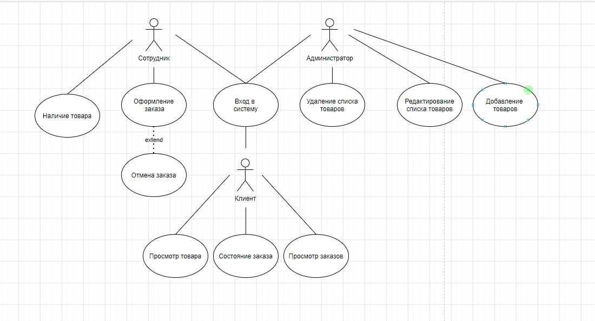
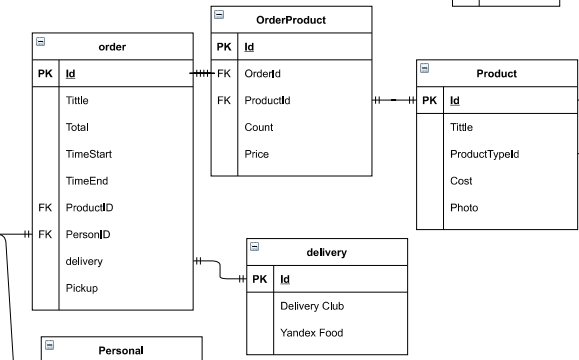
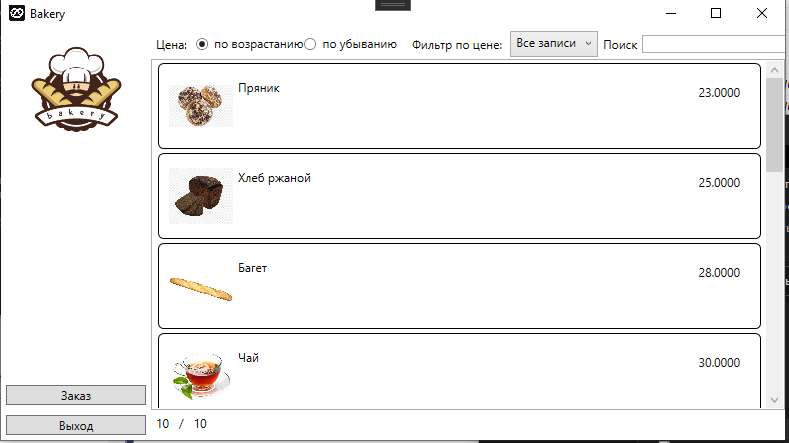

<table style="width: 100%;">
  <tr>
    <td style="text-align: center; border: none;"> 
        Министерство образования и науки РФ <br/>
        ГБПОУ РМЭ "Йошкар-Олинский Технологический колледж 
    </td>
  </tr>
  <tr>
    <td style="text-align: center; border: none; height: 45em;">
        <h2>
            Курсовой проект <br/>
            "Проектирование и разработка информационных систем" <br/>
            для группы И-31
        <h2>
    </td>
  </tr>
  <tr>
    <td style="text-align: right; border: none; height: 20em;">
        <div style="float: right;" align="left">
            <b>Разработал</b>: <br/>
           Решетов Юрий Александрович <br/>
            <b>Проверил</b>: <br/>
            Колесников Евгений Иванович
        </div>
    </td>
  </tr>
  <tr>
    <td style="text-align: center; border: none; height: 1em;">
        г.Йошкар-Ола, 2021
    </td>
  </tr>
</table>

<div style="page-break-after: always;"></div>


# Содержание

* [Теоретическая часть](#Теоретическая-часть)


# Теоретическая-часть
## Диаграммы

### Предметная область  Фитнес-центр.Подсистема работы с сотрудниками.

### Диаграмма Use Case:




### Диаграмма ER:



# Практическая часть
## Программирование С#


### Приложение было разработанно в Visual Studio, пример работы программы:
### Главное окно:

#### Прмер кода разметки страницы:
   <StackPanel 
    Orientation="Horizontal" 
    VerticalAlignment="Center">
                <Label Content="Цена: "/>
                <RadioButton 
        GroupName="Price"
        Tag="1"
        Content="по возрастанию" 
        IsChecked="True" 
        Checked="RadioButton_Checked"
        VerticalContentAlignment="Center"/>
                <RadioButton 
        GroupName="Price" 
        Tag="2"
        Content="по убыванию" 
        Checked="RadioButton_Checked"
        VerticalContentAlignment="Center"/>
                <Label Content="Фильтр по цене: "
        Margin="10,0,0,0"
        VerticalAlignment="Center"/>
                <ComboBox
    Name="DiscountFilterComboBox"
    SelectedIndex="0"
    SelectionChanged="DiscountFilterComboBox_SelectionChanged"
    ItemsSource="{Binding FilterByDiscountNamesList}"/>
                <Label Content="Поиск"/>
                <TextBox
                    x:Name="SearchFilterTextBox"
                    Width="250"
                    VerticalAlignment="Center"
                    KeyUp="TextBox_KeyUp"/>
            </StackPanel>
            <StackPanel 
                Orientation="Horizontal"
                Grid.Row="2"
                >
                <Label Content="{Binding FilteredServicesCount}"/>
                <Label Content="/"/>
                <Label Content="{Binding ServicesCount}"/>


            </StackPanel>
            <ListView
            Grid.Row="1"
            Grid.Column="1"
            ItemsSource="{Binding ProductList}"
            x:Name="ProductListView">
                <ListView.ItemContainerStyle>
                    <Style 
                    TargetType="ListViewItem">
                        <Setter 
                        Property="HorizontalContentAlignment"
                        Value="Stretch" />
                    </Style>
                </ListView.ItemContainerStyle>
                <ListView.ItemTemplate>
                    <DataTemplate>
                        <!-- рисуем вокруг элемента границу с загругленными углами -->
                        <Border 
                BorderThickness="1" 
                BorderBrush="Black" 
                CornerRadius="5">
                            <!-- основная "сетка" из 3-х столбцов: картинка, содержимое, цена -->
                            <Grid 
                    Margin="10" 
                    HorizontalAlignment="Stretch">
                                <Grid.ColumnDefinitions>
                                    <ColumnDefinition Width="64"/>
                                    <ColumnDefinition Width="*"/>
                                    <ColumnDefinition Width="100"/>
                                </Grid.ColumnDefinitions>

                                <Image
                        Width="64" 
                        Height="64"
                        Source="{Binding Path=ImagePreview}" />
                                <!-- ,TargetNullValue={StaticResource DefaultImage} -->

                                <TextBlock 
                        Text="{Binding Price}" 
                        Grid.Column="2" 
                        HorizontalAlignment="Right" 
                        Margin="10"/>

                                <!-- для содержимого рисуем вложенную сетку -->
                                <Grid Grid.Column="1" Margin="5">
                                    <Grid.RowDefinitions>
                                        <RowDefinition Height="20"/>
                                        <RowDefinition Height="20"/>
                                        <RowDefinition Height="*"/>
                                    </Grid.RowDefinitions>

                                    <StackPanel
                            Orientation="Horizontal">

                                        <TextBlock 
                                Text="{Binding Name}"/>

                                    </StackPanel>

                                    <TextBlock 
                            Text="{Binding Storage.Title}" 
                            Grid.Row="1"/>
                                </Grid>
                            </Grid>
                        </Border>
                    </DataTemplate>
                </ListView.ItemTemplate>
            </ListView>
#### Пример Логики главной страницы:

```cs

namespace Yuro4ka
{
    public partial class Product
    {
        
        public Uri ImagePreview
        {
            get
            {
                var imageName = System.IO.Path.Combine(Environment.CurrentDirectory, Photo ?? "");
                return System.IO.File.Exists(imageName) ? new Uri(imageName) : new Uri("pack://application:,,,/img/picture.png");
            }
        }
        public float DiscountFloat
        {
            get
            {
                return Convert.ToSingle(Price ?? 0);
            }
        }


    }
    public partial class OrderList
    {

        public Uri ImagePreviewOrder
        {
            get
            {
                var imageName = System.IO.Path.Combine(Environment.CurrentDirectory, Logo ?? "");
                return System.IO.File.Exists(imageName) ? new Uri(imageName) : new Uri("pack://application:,,,/logo/picture.png");
            }
        }
       


    }

    /// <summary>
    /// Логика взаимодействия для MainWindow.xaml
    /// </summary>
    public partial class MainWindow : Window, INotifyPropertyChanged
    {

        private List<Product> _ProductList;
        public List<Product> ProductList
        {
            get
            {
                var FilteredServiceList = _ProductList.FindAll(item =>
                item.DiscountFloat >= CurrentDiscountFilter.Item1 &&
                 item.DiscountFloat < CurrentDiscountFilter.Item2);

                if (SearchFilter != "")
                    FilteredServiceList = FilteredServiceList.Where(item =>
                        item.Name.IndexOf(SearchFilter, StringComparison.OrdinalIgnoreCase) != -1).ToList();

                if (SortPriceAscending)
                    return FilteredServiceList.OrderBy(item => (item.Price)).ToList();
                else
                    return FilteredServiceList.OrderByDescending(item => (item.Price)).ToList();
            }
            set
            {
                _ProductList = value;
                if (PropertyChanged != null)
                {
                    PropertyChanged(this, new PropertyChangedEventArgs("ProductList"));
                    PropertyChanged(this, new PropertyChangedEventArgs("ServicesCount"));
                    PropertyChanged(this, new PropertyChangedEventArgs("FilteredServicesCount"));
                }
            }
        }

        public MainWindow()
        {
            InitializeComponent();
            this.DataContext = this;
            ProductList = Core.DB.Product.ToList();
        }

        private void Button_Click(object sender, RoutedEventArgs e)
        {

        }

        private void ExitButton_Click(object sender, RoutedEventArgs e)
        {
            Application.Current.Shutdown();
        }


        private Boolean _SortPriceAscending = true;

        public event PropertyChangedEventHandler PropertyChanged;

        public Boolean SortPriceAscending
        {
            get { return _SortPriceAscending; }
            set
            {
                _SortPriceAscending = value;
                if (PropertyChanged != null)
                {
                    PropertyChanged(this, new PropertyChangedEventArgs("ProductList"));
                    PropertyChanged(this, new PropertyChangedEventArgs("ServicesCount"));
                    PropertyChanged(this, new PropertyChangedEventArgs("FilteredServicesCount"));
                }
            }
        }
        private void RadioButton_Checked(object sender, RoutedEventArgs e)
        {
            SortPriceAscending = (sender as RadioButton).Tag.ToString() == "1";
        }
        private List<Tuple<string, float, float>> FilterByDiscountValuesList =
    new List<Tuple<string, float, float>>() {
        Tuple.Create("Все записи", 0f, 500f),
        Tuple.Create("от 0 до 25", 0f, 25f),
        Tuple.Create("от 25 до 50", 25f, 50f),
        Tuple.Create("от 50 до 100", 50f, 100f),
        Tuple.Create("от 100 до 250", 100f, 250f),
        Tuple.Create("от 250 до 500", 250f, 500f)
    };
        public List<string> FilterByDiscountNamesList
        {
            get
            {
                return FilterByDiscountValuesList
                    .Select(item => item.Item1)
                    .ToList();
            }
        }
        private Tuple<float, float> _CurrentDiscountFilter = Tuple.Create(float.MinValue, float.MaxValue);

        public Tuple<float, float> CurrentDiscountFilter
        {
            get
            {
                return _CurrentDiscountFilter;
            }
            set
            {
                _CurrentDiscountFilter = value;
                if (PropertyChanged != null)
                {
                    // при изменении фильтра список перерисовывается
                    PropertyChanged(this, new PropertyChangedEventArgs("ServicesCount"));
                    PropertyChanged(this, new PropertyChangedEventArgs("FilteredServicesCount"));
                    PropertyChanged(this, new PropertyChangedEventArgs("ProductList"));
                }
            }
        }
        private void DiscountFilterComboBox_SelectionChanged(object sender, SelectionChangedEventArgs e)
        {
            CurrentDiscountFilter = Tuple.Create(
                FilterByDiscountValuesList[DiscountFilterComboBox.SelectedIndex].Item2,
                FilterByDiscountValuesList[DiscountFilterComboBox.SelectedIndex].Item3
            );
        }
        private string _SearchFilter = "";
        public string SearchFilter
        {
            get { return _SearchFilter; }
            set
            {
                _SearchFilter = value;
                if (PropertyChanged != null)
                {
                    // при изменении фильтра список перерисовывается
                    PropertyChanged(this, new PropertyChangedEventArgs("ProductList"));
                    PropertyChanged(this, new PropertyChangedEventArgs("ServicesCount"));
                    PropertyChanged(this, new PropertyChangedEventArgs("FilteredServicesCount"));
                }
            }
        }
        private void TextBox_KeyUp(object sender, KeyEventArgs e)
        {
            SearchFilter = SearchFilterTextBox.Text;
        }
        public int ServicesCount
        {
            get
            {
                return _ProductList.Count;
            }

        }
        public int FilteredServicesCount
        {
            get
            {
                return ProductList.Count;
            }
        }

        private void OrderOpe_Click(object sender, RoutedEventArgs e)
        {
            var OpenOrder = new Order();
            OpenOrder.ShowDialog();
        }
```

### Окно заказов:

#### Прмер кода разметки страницы заказов:
```xml
 <Grid>
        
        <Grid.ColumnDefinitions>
            <ColumnDefinition Width="200"/>
            <ColumnDefinition Width="*"/>
        </Grid.ColumnDefinitions>

        <StackPanel
            Grid.Column="0" VerticalAlignment="Bottom">
            <Button      
                Height="20"
                Content="{Binding AdminModeCaption}"
                Name="AdminButton"
                Click="AdminButton_Click"/>
            <Button Content="Добавить заказ" x:Name="AddSevice" Click="AddSevice_Click"></Button>
            <Button Content="Выход"></Button>
           
        </StackPanel>
        
        <ListView
            Grid.Column="1"
    Grid.Row="0"
    ItemsSource="{Binding OrderList}"
    x:Name="ProductListView">
            
        <ListView.ItemTemplate>
            
            
            <DataTemplate>
                <!-- рисуем вокруг элемента границу с загругленными углами -->
                <Border 
                BorderThickness="1" 
                BorderBrush="Black" 
                CornerRadius="5">
                    <!-- основная "сетка" из 3-х столбцов: картинка, содержимое, цена -->
                    <Grid 
                    Margin="10" 
                    HorizontalAlignment="Stretch">
                        <Grid.ColumnDefinitions>
                            <ColumnDefinition Width="64"/>
                            <ColumnDefinition Width="*"/>
                            <ColumnDefinition Width="100"/>
                        </Grid.ColumnDefinitions>

                        <Image
                        Width="64" 
                        Height="64"
                        Source="{Binding Path=ImagePreviewOrder}" />
                        <!-- ,TargetNullValue={StaticResource DefaultImage} -->

                        <TextBlock 
                        Text="{Binding Number}" 
                        Grid.Column="2" 
                        HorizontalAlignment="Right" 
                        Margin="10"/>

                            <Button Visibility="{Binding DataContext.AdminVisibility, ElementName=Root}"   Content="Редактировать" HorizontalAlignment="Right"  x:Name="EdditButton" Click="EdditButton_Click" Grid.Column="1" Width="50" Height="30"></Button>
                            <Button Visibility="{Binding DataContext.AdminVisibility, ElementName=Root}"   Content="Удалить" HorizontalAlignment="Right" Margin="0 0 50 0" Click="DeletteButton_Click" x:Name="DeletteButton" Grid.Column="1" Width="50" Height="30"></Button>

                            <!-- для содержимого рисуем вложенную сетку -->
                        <Grid Grid.Column="1" Margin="5">
                            <Grid.RowDefinitions>
                                <RowDefinition Height="20"/>
                                <RowDefinition Height="20"/>
                                <RowDefinition Height="*"/>
                            </Grid.RowDefinitions>

                            <StackPanel
                            Orientation="Horizontal">
                                <TextBlock 
                                Text="{Binding Date}"/>
                                <TextBlock 
                                Text=" | "/>
                                
                            </StackPanel>

                            <TextBlock 
                            Text="{Binding Total}" 
                            Grid.Row="1"/>
                            <TextBlock 
                            Text="{Binding Delivery}" 
                            Grid.Row="2"/>
                               
                            </Grid>
                    </Grid>
                </Border>
            </DataTemplate>
        </ListView.ItemTemplate>
            <ListView.ItemContainerStyle>
                <Style 
                    TargetType="ListViewItem">
                    <Setter 
                        Property="HorizontalContentAlignment"
                        Value="Stretch" />
                </Style>
            </ListView.ItemContainerStyle>
        </ListView>
    </Grid>
```
#### Пример Логики страницы заказов:

```cs
namespace Yuro4ka
{
    /// <summary>
    /// Логика взаимодействия для Order.xaml
    /// </summary>
    public partial class Order : Window, INotifyPropertyChanged
    {
        

        public Order()
        {
            InitializeComponent();
            this.DataContext = this;
            OrderList = Core.DB.OrderList.ToList();
        }

        private List<OrderList> _OrderList;

        public event PropertyChangedEventHandler PropertyChanged;

        public List<OrderList> OrderList
        {
            get
            {
                return _OrderList;
            }
            set
            {
                _OrderList = value;
                if (PropertyChanged != null)
                {
                    PropertyChanged(this, new PropertyChangedEventArgs("OrderList"));
                }
            }
        }

        private void AddSevice_Click(object sender, RoutedEventArgs e)
        {
            var NewService = new OrderList();

            var NewServiceWindow = new OrderWindow(NewService);
            if ((bool)NewServiceWindow.ShowDialog())
            {
                // список услуг нужно перечитать с сервера
                OrderList = Core.DB.OrderList.ToList();
                PropertyChanged(this, new PropertyChangedEventArgs("FilteredProductsCount"));
                PropertyChanged(this, new PropertyChangedEventArgs("ProductsCount"));
            }
        }

        private Boolean _IsAdminMode = false;


        // публичный геттер, который меняет текущий режим (Админ/не Админ)
        public Boolean IsAdminMode
        {
            get { return _IsAdminMode; }
            set
            {
                _IsAdminMode = value;
                if (PropertyChanged != null)
                {
                    PropertyChanged(this, new PropertyChangedEventArgs("AdminModeCaption"));
                    PropertyChanged(this, new PropertyChangedEventArgs("AdminVisibility"));
                }

            }
        }
        // этот геттер возвращает текст для кнопки в зависимости от текущего режима
        public string AdminModeCaption
        {
            get
            {
                if (IsAdminMode) return "Выйти из режима\nАдминистратора";
                return "Войти в режим\nАдминистратора";
            }
        }
        private void AdminButton_Click(object sender, RoutedEventArgs e)
        {
            // если мы уже в режиме Администратора, то выходим из него 
            if (IsAdminMode) IsAdminMode = false;
            else
            {
                // создаем окно для ввода пароля
                var InputBox = new InputBoxWindow("Введите пароль Администратора");
                // и показываем его как диалог (модально)
                if ((bool)InputBox.ShowDialog())
                {
                    // если нажали кнопку "Ok", то включаем режим, если пароль введен верно
                    IsAdminMode = InputBox.InputText == "0000";
                }
            }
        }
        public string AdminVisibility
        {
            get
            {
                if (IsAdminMode) return "Visible";
                return "Collapsed";
            }
        }

        private void EdditButton_Click(object sender, RoutedEventArgs e)
        {
            var SelectedOrder = ProductListView.SelectedItem as OrderList;
            var EditOrderWindow = new OrderWindow(SelectedOrder);
            if ((bool)EditOrderWindow.ShowDialog())
            {
                PropertyChanged(this, new PropertyChangedEventArgs("OrderList"));
            }
        }

        private void DeletteButton_Click(object sender, RoutedEventArgs e)
        {
            var item = ProductListView.SelectedItem as OrderList;
            Core.DB.OrderList.Remove(item);
            Core.DB.SaveChanges();
            OrderList = Core.DB.OrderList.ToList();
        }
    }
```
### Окно добавления и редактирования заказов:

#### Прмер кода разметки страницы редактирования заказов:
```xml
  <Grid>
        <Grid.ColumnDefinitions>
            <ColumnDefinition Width="auto"/>
            <ColumnDefinition  Width="*"/>
        </Grid.ColumnDefinitions>

        

        <StackPanel Grid.Column="1" Orientation="Horizontal" Visibility="{Binding NewProduct}">
            <Label Content="Идентификатор услуги: "/>
            <Label Content="{Binding CurrentService.Id}"/>
        </StackPanel>
        <StackPanel Grid.Column="1" Margin="5 60">
            <Label Content="ВНомер"/>
            <TextBox Text="{Binding CurrentService.Number}"/>
            <Label Content="Время заказа"/>
            <TextBox Text="{Binding CurrentService.Date}"/>
            <Label Content="Цена"/>
            <TextBox Text="{Binding CurrentService.Total}"/>
            <Label Content="Курьер"/>
            <TextBox Text="{Binding CurrentService.Delivery}"/>
           
           
            

            <Button Width="100" Margin="5" x:Name="SaveButton" Click="SaveButton_Click" HorizontalAlignment="Left">Сохранить</Button>
        </StackPanel>
    </Grid>
</Window>
    ```
#### Пример Логики страницы редактирования заказов:

```cs
namespace Yuro4ka
{
    /// <summary>
    /// Логика взаимодействия для OrderWindow.xaml
    /// </summary>
    public partial class OrderWindow : Window, INotifyPropertyChanged
    {
        public OrderWindow(OrderList order)
        {
            InitializeComponent();
           CurrentService = order;
            DataContext = this;
        }
        public OrderList CurrentService { get; set; }

        public string WindowName
        {
            get
            {
                return CurrentService.Id == 0 ? "Новая услуга" : "Редактирование услуги";
            }
        }

        public event PropertyChangedEventHandler PropertyChanged;

       
        private void SaveButton_Click(object sender, RoutedEventArgs e)
        {
            if (CurrentService.Total <= 0)
            {
                MessageBox.Show("Стоимость услуги должна быть больше нля");
                return;
            }
            if (CurrentService.Delivery =="")
            {
                MessageBox.Show("Не может быть пустым");
                return;
            }
            string Logos = CurrentService.Delivery;

            if (Logos == "Delivery" || Logos == "YandexFood" || Logos == "RadugaVkusa" || Logos == "Yin-Yan")
            {

                string sus="logo/" + Logos + ".png";
                CurrentService.Logo = sus;

            }
            else
            {
                MessageBox.Show("Выберите крьера из списка Delivery, YandexFood, RadugaVkusa, Yin-Yan");
                return;
            }

           

            var NumberOrder = CurrentService.Id;
            CurrentService.Number = NumberOrder;
           
            


            // если запись новая, то добавляем ее в список
            if (CurrentService.Id == 0)
                Core.DB.OrderList.Add(CurrentService);

            // сохранение в БД
            try
            {
                Core.DB.SaveChanges();
            }
            catch
            {
            }
            DialogResult = true;
        }
    }


namespace kursMinin.window
{
    /// <summary>
    /// Логика взаимодействия для ServiceWindow.xaml
    /// </summary>
    public partial class ServiceWindow : Window, INotifyPropertyChanged
    {

        public List<Userman> UsermanList { get; set; }

        public ServiceWindow(Zakazy zakazy)
        {
            InitializeComponent();
            this.DataContext = this;
            CurrentOrder = zakazy;
            UsermanList = Core.DB.Userman.ToList();

        }
        public Zakazy CurrentOrder { get; set; }
        public string WindowName
        {
            get
            {
                return CurrentOrder.id == 0 ? "Новая услуга" : "Редоктирование улсгуи";
            }
        }

        public event PropertyChangedEventHandler PropertyChanged;

        private void SaveButton_Click(object sender, RoutedEventArgs e)
        {


            {
                if (CurrentOrder.id == 0)
                    Core.DB.Zakazy.Add(CurrentOrder);

                
                try
                {
                    Core.DB.SaveChanges();
                }
                catch
                {
                }
                DialogResult = true;
            }
        
           
           
        }
       
        public string NewProduct
        {
            get
            {
                if (CurrentOrder.id == 0) return "collapsed";
                return "visible";


            }
        }
    }
}
```
# Тестировние
## Создание библиотеки классов и Юнит тестов
### Библиотека классов
```cs
namespace CompanyCoreLib
{
    public class Analytics
    {

        public Boolean CheckPrice(int price)
        {
            if (price <= 100)
            {
                return false;
            }
            else
                return true;
        }

        public int DiscountPrice(int price)
        {
            int sum = ((price / 100) * 15) * price;
            return sum;
        }

        public string PriceNotNull(int price)
        {
            if (price <= 0)
            {
                return "Цена не может быть меньше или равна нулю!!!";
            }
            else
                return "Всё правильно";
        }
    }
}


```
### Юнит тесты 

```cs
namespace UnitTestProject
{
    [TestClass]
    public class UnitTestProject1
    {
        static Analytics disk_price;
        [ClassInitialize]
        static public void Init(TestContext tc)
        {
            disk_price = new Analytics();
        }


        //Проверка на размер цены
        [TestMethod]
        public void CheckPrice()
        {
            Assert.IsTrue(disk_price.CheckPrice(5000));
        }


        //Проверка на тип данных
        [TestMethod]
        public void ValidationPrice()
        {
            Assert.IsInstanceOfType(disk_price.DiscountPrice(100), typeof(int));
        }

        //Проверка на нулевую цену
        [TestMethod]
        public void PriceNotNull()
        {
            Assert.AreEqual(disk_price.PriceNotNull(-12), "Цена не может быть меньше или равна нулю!!!");
        }
    }
}
```
## Пример работы юнит тестов:

